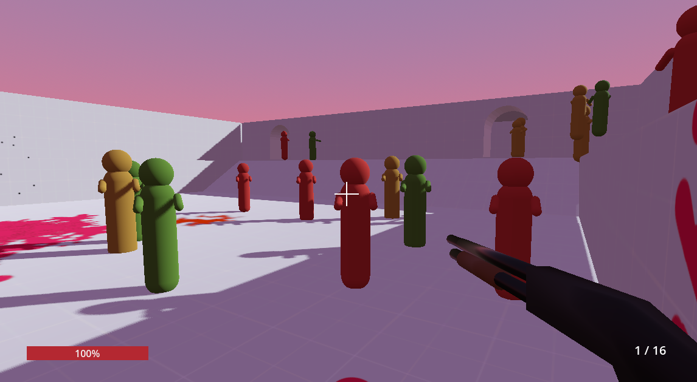

Murder Floor
============

A tini-tiny first-person zombie shooter. Survive wave after wave of Zombie attacks

Created in the [Godot 4.0](https://godotengine.org/) as a project to test and learn about the Godot open source game engine.

Features!
---------

### Huge Selection on Weapons!
Choose between a variety of weapons such as Pistol, Assault Rifle and Shotgun! (Okay that's it actually)

### Amazing Graphics!
If you like capsule meshes in bold colours.

### Enemy Variety!
Several different types of zombies are coming for your brain! Normal zombies, fast zombies and zombies throwing their own head. What more could you want?

Controls
--------

- WASD to move
- Mouse to look around
- Left mouse button to shoot
- Shift to dash 
- Switch weapons with 1,2,3 or using the mouse wheel

How to edit / run the game
--------------------------

1. Clone the repository. Alternatively, [download](https://github.com/cesko/godot_fps_test/archive/refs/heads/main.zip) the game files as a zip-archive. Unzip the archive into a new directory (e.g. called `fps_test`) 
2. Download and unzip Godot 4.0 (https://godotengine.org/download) (I am using version 4.0.2 Standard 64 bit)
3. Run the Godot executable (e.g. on Windows: `Godot_v4.0.2-stable_win64.exe`)
4. In the Godot *Project Manager* window, select *Import Project*
5. In the *Import Existing Project* window, click *Browse* and navigate to the game files from step 1. Select the `project.godot` file and click *Open* 
6. Click *Import & Edit* to open the game in the Godot editor
7. To run the project, click the start button on the top right or hit F5

Attribution
-----------
I would like to give attribution to the nice authors providing the free resources I used in this project:

### Graphical Assets
 - [kenney.nl 2D Particle Pack](https://www.kenney.nl/assets/particle-pack)
 - [kenney.nl Prototype Textures](https://www.kenney.nl/assets/prototype-textures)
 - [kenney.nl Splat Pack](https://www.kenney.nl/assets/splat-pack)

### Sound Effects
 - [gattoangus: 9mm pistol shoot short reverb](https://pixabay.com/sound-effects/9mm-pistol-shoot-short-reverb-7152/)
 - [KlawyKogut: Empty Gun Shot](https://pixabay.com/sound-effects/empty-gun-shot-6209/)
 - [MaximBomba: Rifle-or-shotgun-reload](https://pixabay.com/sound-effects/rifle-or-shotgun-reload-6787/)
 - [manchesterprod2: Male Ahhhh](https://pixabay.com/sound-effects/male-ahhhh-104524/)
 - [NicknameLarry: Monster Roar](https://pixabay.com/sound-effects/monster-roar-6985/)
 - [MAXOU-YT: Cash Register](https://pixabay.com/sound-effects/cash-register-141427/)
 - [nanity05: Zombie](https://pixabay.com/sound-effects/zombie-6851/)
 - [pixabay: 080168 PistolReloadSound.wav](https://pixabay.com/sound-effects/080168-pistolreloadsoundwav-45468/)
 - [Uberproduktion: Shot Rifle 39 mm](https://pixabay.com/sound-effects/shot-rifle-39-mm-37542/)
 - [FilmmakersManual: Shotgun Firing (3)](https://pixabay.com/sound-effects/shotgun-firing-3-14483/)
 - [lumikon: Shotgun reload sfx](https://pixabay.com/sound-effects/shotgun-reload-sfx-36524/)

